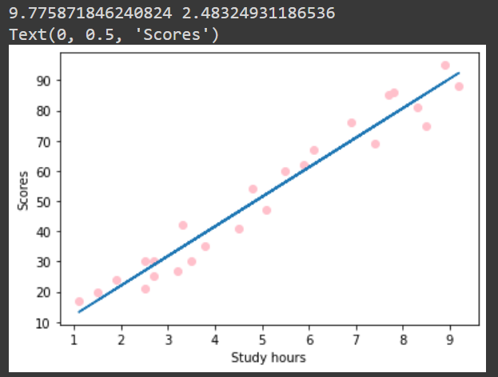
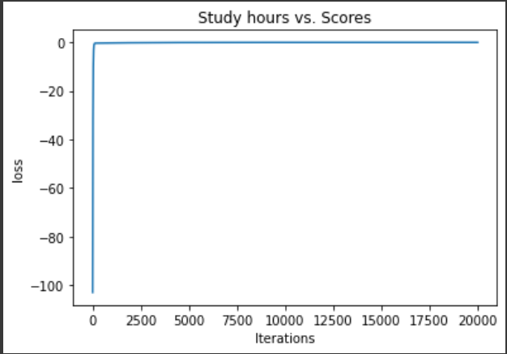

# Implementation-of-Linear-Regression-Using-Gradient-Descent

## AIM:
To write a program to predict the profit of a city using the linear regression model with gradient descent.

## Equipments Required:
1. Hardware – PCs
2. Anaconda – Python 3.7 Installation / Jupyter notebook

## Algorithm
1.For Gradient Design use the standard libraries in the python.
2.Use the .isnull()function to check the empty .
3.Use the default function.
4.Use the loop function for a linear equation.
5.Predict the value for the y.
6.Print the program.
7.plot the graph by using scatters keyword.
8.End the program.

## Program:
```
/*
Program to implement the linear regression using gradient descent.
Developed by: S V SHADHANASHREE
RegisterNumber:  212223230202
*/
```
```
import numpy as np
import pandas as pd
import matplotlib.pyplot as plt
df=pd.read_csv("student_scores.csv")
df.head()
df.isnull().sum()
x=df.Hours
x.head()
y=df.Scores
y.head()
n=len(x)
m=0
c=0
l=0.001
loss=[]
for i in range(10000):
  ypred=m*x+c
  MSE=(1/n)*sum((ypred-y)*2)
  dm=(2/n)*sum(x*(ypred-y))
  dc=(2/n)*sum(ypred-y)
  c=c-l*dc
  m=m-l*dm
  loss.append(MSE)
  #print(m,c)
  y_pred=m*x+c
plt.scatter(x,y,color="red")
plt.plot(x,y_pred)
plt.xlabel ("study hours")
plt.ylabel("scores")
plt.title("study hours vs scores")
plt.plot(loss)
plt.xlabel("iteration")
plt.ylabel("loss")

```

## Output:




## Result:
Thus the program to implement the linear regression using gradient descent is written and verified using python programming.
